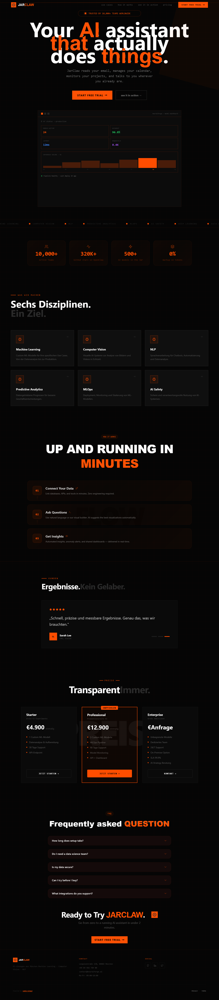

<h3>
   
  <span style="vertical-align: middle; margin-left: 8px;">JarClaw | Autonomous AI Agent Systems</span>
</h3>

**JarClaw** is a high-performance, agentic AI platform designed to move beyond simple chat interfaces. It specializes in **Autonomous Execution**—bridging the gap between AI reasoning and real-world web actions.


## 🛠 Tech Stack & Design Philosophy
Built with a **Brutal-Minimalist** aesthetic, the project focuses on high-contrast UI, rapid performance, and developer-centric UX.

* **Language:** TypeScript (Strict Mode)
* **Framework:** Next.js 14+ (App Router)
* **Styling:** Tailwind CSS
* **Icons:** Lucide React

---

## ⚡ Core Features

### 1. The Six Disciplines
Our architecture is split into six specialized automation domains:
* **Email & Calendar:** Autonomous inbox triage.
* **Web Automation:** Browser execution without APIs.
* **DevOps:** PR reviews and CI/CD monitoring.
* **Research:** Neural document processing.
* **IoT & Smart Home:** Hardware/Software bridging.
* **Omni-Channel:** Control via Telegram, Slack, or Discord.

### 2. Signature Components
* **`<Glitch />`:** A high-performance CSS/React component for "hacker-style" text reveals.
* **`<TwoDButton />`:** Custom-engineered buttons with offset shadows and brutalist hover states.
* **`Holo-Cards`:** Glassmorphism mixed with industrial borders for the FAQ and Services sections.

---

## 📂 Project Structure

```text
src/
├── app/
    ├── globals.css      # Custom keyframes for Glitch and Neon effects
│   ├── layout.tsx       # Global providers, fonts (Space Grotesk), and metadata
│   └── page.tsx         # Main Landing Page (Assembles all sections)
├── components/
    ├── Hero.tsx         # High-impact Glitch introduction
    ├── Services.tsx     # The Six Disciplines grid
    ├── HowItWorks.tsx   # Step-by-step logic flow
    ├── Testimonial.tsx  # Proof of work & client results
    ├── Pricing.tsx      # Tiered subscription models
    ├── FAQ.tsx          # Agentic automation Q&A
    ├── Glitch.tsx       # Reusable text animation engine
    └── TwoDButton.tsx   # The primary UI action component
```



